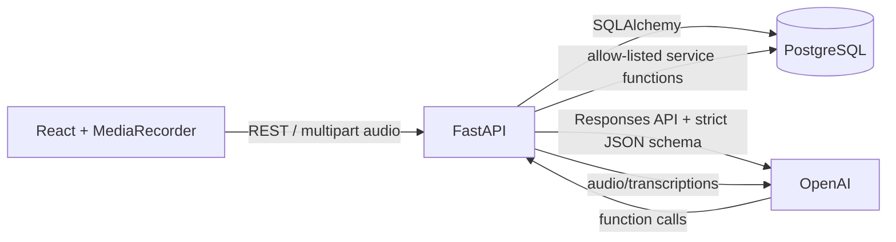
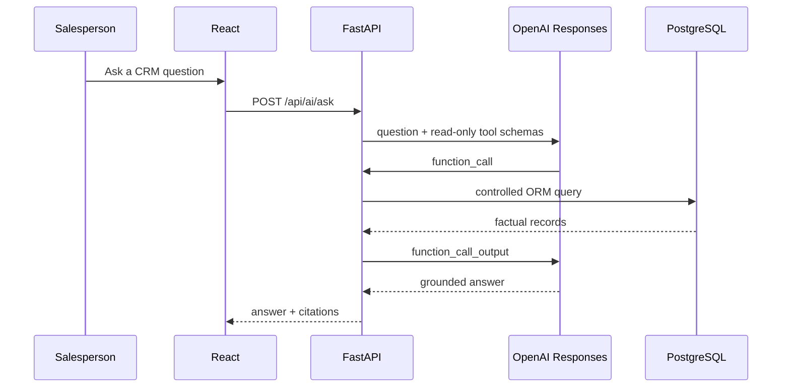

# SalesPilot architecture

SalesPilot is deliberately a **human-in-the-loop** CRM assistant. AI returns drafts; database records are written only by a confirm endpoint after the salesperson has reviewed and edited the result.

## Frontend

Vite and React provide six connected screens: overview, customers, AI meeting brief, voice meeting review, action items, and Ask SalesPilot. `MediaRecorder` keeps audio in-browser until the salesperson stops it. The browser calls only the FastAPI API and never receives an OpenAI key.

## Backend

FastAPI uses Pydantic input/output DTOs and never serializes raw SQLAlchemy objects. A request-ID middleware adds a correlation ID and endpoint duration to structured logs, while exception handlers return the standard `{ "error": { "code", "message", "request_id" } }` envelope.

## Database

The PostgreSQL schema is created by Alembic revision `0001_initial`; the app does not run `create_all` in production. Foreign keys express customer → contacts/meetings/opportunities/actions/activities/payments and meeting → insights/actions. `app.seed` creates five entirely fictional accounts.

## AI boundary

`app.ai` is the only OpenAI SDK boundary. Meeting extraction uses Responses structured output with the `MeetingAnalysis` Pydantic JSON schema. The conversational agent gets only strict, read-only tool schemas. It cannot receive a SQL connection, SQL string, write tool, or secret. Tool calls dispatch to `SalesToolService`, which validates arguments and performs parameterized ORM queries.

## Voice and confirmation pipeline

1. Browser records WebM audio, supporting start, pause, resume, stop, and cancel.
2. API validates MIME type, filename extension, and a 25 MB limit before transcription.
3. The backend calls the audio transcription API with its private API key.
4. Transcript is analyzed into a draft. The customer matcher returns `MATCHED`, `AMBIGUOUS`, or `UNKNOWN`; ambiguous matches require explicit user selection.
5. The review UI exposes transcript, customer, summary, extracted fields, and action dates.
6. `POST /api/meetings/confirm` persists the meeting, insights, and action items atomically.

## Security and operations

- `OPENAI_API_KEY` appears only in backend environment configuration and `.env` is ignored.
- No arbitrary SQL, direct model database access, or automated CRM writes are permitted.
- Audio and AI failure modes have safe client messages; logs exclude API keys and full transcripts.
- Docker Compose runs PostgreSQL only, keeping local backend/frontend iteration fast.

